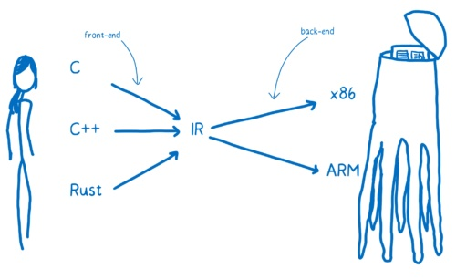

<!--
y * @Author: xiuquanxu
 * @Company: kaochong
 * @Date: 2020-01-30 11:21:51
 * @LastEditors  : xiuquanxu
 * @LastEditTime : 2020-02-01 23:43:46
 -->
# 第一章 引论

## 1.1 什么是编译程序
编译程序: 将C或者Java(源语言)这样高级语言转化为低级语言(目标语言)的翻译程序称为编译程序。

高级语言分为两种: 
* 编译程序：先编译成二进制文件然后执行，例如c或者java等。
* 解释程序：边解释边执行，例如JavaScript或者Python等。
本书主要讨论编译程序不对解释程序讲解，实际上许多编译程序的构造和实现同样适用于解释程序。

交叉编译: 如果一个编译程序产生不同于其宿主机的机器代码，则称为交叉编译程序。  

世界上第一个编译程序是: Fortran编译程序，于20世纪50年代中期成功研制。  

## 1.2 编译过程概述
编译程序工程过程一般划分为如下阶段:  
* 词法分析
* 语法分析
* 语义分析
* 中间代码产生
* 中间代码优化
* 目标代码生成

第一阶段，词法分析: 对构成源程序的字符串每一个字符逐个进行分析，识别出一个个单词，如关键字(if for while break....)，标识符，常数等。
<!-- TODO: demo -->

在词法分析阶段的工作中所依循的是语言的词法规则。描述词法规则或者解析词法规则的有效工具是正则式和有限自动机。  

第二阶段，语法分析: 词法分析是针对于每个字符串的分析，而语法分析则是针对于该句的分析，并不涉及上下文。通过语法分析，确定整个输入串是否构成正确的语法。语法分析所依循的是语言的语法规则。例如：  
```
z = x + 100 * y;
```  
词法分析的目的：第一确定该表达式是正确的，第二确定该表达式是一个算术表达式以及是一个赋值语句。

第三阶段，语义分析与中间代码产生。该阶段主要有两个工作。其一对每种语法范畴进行静态语义检查，例如比变量是否定义，类型是否正确等。其二翻译语句生成中间代码，这一阶段所依据是语言的语义规则。  

在第二步中翻译过程中，中间代码实际上指的是一种含义明确、便于处理的记号系统独立于具体的硬件。这种记号系统比较常见的采用"三地址指令"、"四元式"、间接三元式、逆波兰记号和树形表示等(此处内容隶属于计算机组成原理)作为中间代码。

三地址，两个操作数以及一个结果：
<table>
    <tr>
        <td>操作数A</td>
        <td>操作数B</td>
        <td>结果C</td>
    </tr>
</table>  

四元式，一个操作符，两个操作数，一个结果：  
<table>
    <tr>
        <td>算符</td>
        <td>操作数A</td>
        <td>操作数B</td>
        <td>结果C</td>
    </tr>
</table>

一个四元式例子：z = (x + 100) * y / w，经过前面的词法分析语法分析以及语义分析后生成中间的四元式的中间代码如下：  
<table>
    <tr>
        <td>序号</td>
        <td>算符</td>
        <td>左操作数</td>
        <td>右操作数</td>
        <td>结果</td>
    </tr>
    <tr>
        <td>1</td>
        <td>+</td>
        <td>x</td>
        <td>100</td>
        <td>t1</td>
    </tr>
    <tr>
        <td>2</td>
        <td>*</td>
        <td>t1</td>
        <td>y</td>
        <td>t2</td>
    </tr>
    <tr>
        <td>3</td>
        <td>/</td>
        <td>t2</td>
        <td>w</td>
        <td>t3</td>
    </tr>
</table>

t1, t2是临时变量

第四阶段，中间代码优化。优化的任务是对中间代码进行加工变换，以保证在最后阶段能够产出更为高效的目标代码。优化的主要方面有：公共子表达式的提取、循环优化、删除无用代码等等。有时，为了便于"并行运算"，还可以对代码进行并行处理。处理的原则是程序等价变换规则。例如：  
```
for (let k = 1; k < 100; k += 1) {
    m = i + 10 * k;
    n = j + 10 * k;
}
```
此段代码生成的四元式实际要进行300次加法(100次i+10*k,100次j+10*k, 100次k+=1)和200次乘法(100次10*k，100次10*k)，如果等价变换为：
```
m = i; n = j;
for (let k = 1; k < 100; k += 1) {
    m = m + 10;
    n = n + 10;
}
```
只需要进行300次加法，不需要进行乘法运算。
实际上这种转换是在四元式中进行等价转换的，我这里为了方便并没有写出所有四元式只是通过变换写法来表达其中含义。

这种优化是十分显著的，尤其是在多数硬件中，乘法的时间比加法时间要长的多。  

这里也给我们一个编写代码时候的启示，**我们编写代码时候实际上可以基于编译的角度去思考如果让代码运行的更快，尤其对于解释型语言来说，但是与此同时我们要兼顾代码的可读性**


第五阶段，目标代码生成这个阶段任务是：把中间代码变换成特定机器上的低级语言代码。这个阶段实现了最后的翻译工作，它的工作有赖于硬件系统结构和机器指令含义。这个阶段非常复杂，涉及到硬件系统通部件的运用，机器指令的选择，各种数据类型变量的存储空间分配，以及寄存器和后援寄存器的调度等等。如何产生出足以充分发挥硬件小路的目的代码是一件非常不容易的事情。  

目标代码的形式可以是绝对指令代码或者可重定位指令代码或者汇编指令代码。如果目标代码是绝对命令代码，则这种目标代码可以立即执行。如果目标代码是汇编代码，则需汇编器汇编之后才能运行。必须指出的是，现在绝大多数实用编译程序产生的目标代码都是一种可重定位的指令代码。这种目的代码在运行前必须借助于一个连接装置把各个目标模块连接一起，确定主存中位置，装入内存中指定的起始地址，成为一个绝对指令代码程序。

上述五个阶段是一个典型分法，实际上各个语言在实现上会各有差异，但是多数编译器工作过程大致都是这五个阶段。  

代码执行过程实际上是：预处理(可有可无)-编译-链接-执行，我们上面讲的这些只是编译阶段做的事。如果真正想了解后面链接和执行参看<<程序员的自我修养>>  


## 1.3 编译程序的结构

### 1.3.1 编译程序总框
编译程序的设计：  
词法分析器-语法分析器-语义分析器与中间代码生成-优化器-目标代码生成器  
其中贯穿整个过程的还有表格管理和出错处理。

词法分析器又称为**扫描器**，语法分析器又称为**分析器**。

有的编译程序识别出各类语法后，构造并输出一棵表示语法结构的树叫做抽象语法树(AST），然后根据AST进行语义分析和中间代码生成。还有很多编译程序并不构造真正语法树，而是直接进行语义分析。

### 1.3.2 表格与表格管理  
表格的作用是**登记源程序的各类信息和编译各阶段的进展状况**。表格中最重要的是**符号表**，它用来登记源程序常量，变量（类型、内存、地址）等信息。

当扫面器识别出一个名字后，将名字添加到符号表中，但这时不能确定名字的属性，他的各种属性后续各阶段才能填入。例如，名字的类型等要语义分析时才能确定，而内存地址可能要目标代码生成时才能确定。  

由此可见，编译的各个阶段都设计对表格的查找和更新。

### 1.3.3 出错处理
错误机制功能：
* 编译出错时候给用户反馈
* 收集编译的各个阶段错误（例如变量未定义，缺少括号，作用域错误，类型不一致等）
* 能够尽可能错误影响的范围，使得源程序的其余部分能继续编译，甚至可以自动校正错误等。

### 1.3.4 遍

遍指的是对源程序的中间结果从头到尾扫描一次。遍的次数和遍的过程都依赖于不同编译器实现方式不一样。有的可能词法分析就是单独的一遍，有的把词法分析和语法分析作为一次遍。在一些优化级别高的编译器中，往往还可以把优化阶段分为若干遍来实现。  

一个编译器究竟应该分成几遍，如何划分，是跟源语言、设计要求、硬件等因素有关，因此很难统一划分。遍多好处是整个编译程序的逻辑结构清晰，优化程度高，但是代价就是耗时，占资源。因此在主存可能的前提下，一般还是遍数尽可能少一点好。应当注意并不是每种语言都可以用单遍编译程序实现。  

### 1.3.5 编译前端与后端


编译前端：主要由与源语言有关但与目标机（window、linux、mac）无关那部分组成。这些部分通常包括词法分析、语法分析、语义分析与中间代码生成，有的代码优化工作也可以包括在前端。

编译后端：主要包括编译程序中与目标机有关的那部分代码，如代码优化和目标代码生成。通常后端不依赖于源语言而仅仅依赖于中间语言。

通常编译器设计为不同源程序生成相同的中间代码，后端使用同一个编译后端，这样可为同一台机器生成不同语言的编译程序。然而，由于不同语言存在某些微妙区别，这种方案取得成果还是有局限的。  

这种设计的编译器有：  
LLVM：编译前前端统一将源程序转为LLVM IR然后再由LLVM后端转换为指定平台的可执行文件。

  


例如Java为了能够将编译后的程序能够将一个平台移植到另外一个平台，Java定义了一种虚拟字节码ByteCode，只要对应平台实现了ByteCode解释器（Jvm），那么该平台可以运行任何Java程序。

## 1.4 编译程序与程序设计环境

编译程序无疑是实现高级语言的一个重要工具，但是支持程序设计人员进行程序开发通常还需要其他工具，如：**编辑器**,**连接程序**,**调试工具**。编译程序和这些工具组合在一起便是程序设计环境（IDE，Pycharm等）  

我们平常使用的sumbline或者vscode（未装插件）不是编译器而是一个编辑器。在一个程序设计环境中，编译程序起着重要作用。连接程序、调试程序等工具的工作直接依赖于编译程序所产生结果，而其他工具构造也常常要用到编译的原理、方法和技术。  

## 1.5 编译程序生成  
以前的编译程序都是机器语言或者汇编语言，开发难度大。为了提高开发效率越来越多人使用高级语言作为编译程序。

流程：机器A已有一个用A机器实现的某高级语言L，那么我们就可以通过L来编写L2，然后L2经过L编译后得到A上的机器码就可以运行L2语言了。  

最后，谈一下如何学习构造编译程序，要在某一台机器上为某种语言构造一个编译程序，必须掌握以下三个内容：
* 深刻理解源语言（c或者java）其构造（语法等）
* 目标语言，假定目标语言是机器语言，那么必须搞清楚硬件的系统结构和操作系统的功能。
* 编译方法，把一个语言程序翻译成另外一个语言程序有很多方法，但必须准确掌握一二。  

