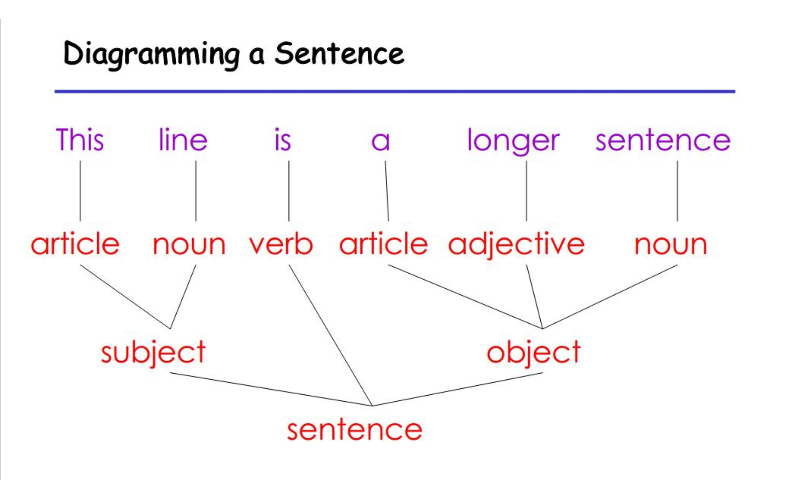
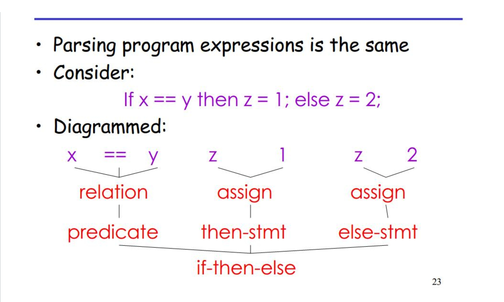
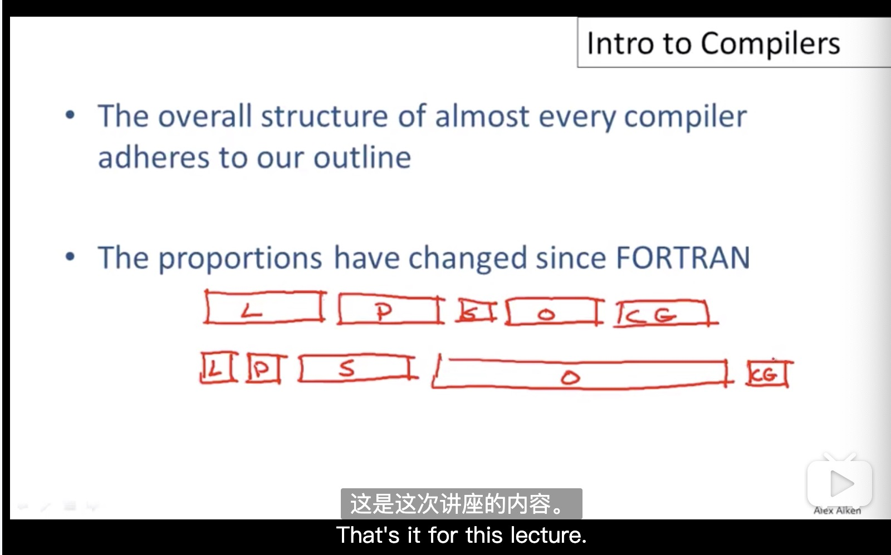

<!--
 * @Author: xiuquanxu
 * @Company: kaochong
 * @Date: 2020-09-13 01:43:25
 * @LastEditors: xiuquanxu
 * @LastEditTime: 2020-09-13 16:02:04
-->
## 语言实现  
- 编译器在低层语言中有重要位置（c，c++，go，rust）  
- 高级语言往往用的是解释器（Python，Ruby）
- 一些（java，js）提供了编译器和解释器（解释器+JIT（运行时的编译器compiler））

## 语言历史  
1954 IBM开发了704计算机，全部由汇编语言编写。问题点是软件开发成本远远高于硬件成本。  

为了解决软件开发成本，John Backus 1953年开发了“Speedcoding”它是早期解释器的雏形。它的有点是大大提高了开发软件成本，但是问题点是效率慢了10-20倍（现代解释器有同样的问题，解释器要比编译器执行效率慢得多），内存占用多

为了节约开发成本和效率问题，开发了高级语言Fortran，1958年大于百分之50的软件使用Fortran开发的，性能接近于手写的汇编。  

## Fortran  

- 第一个编译器，巨大影响在计算机科学上  
- 让我们投入大量的理论和实践工作    
- 现代编译器仍然保存着Fortran的样子  

## 编译器结构  

1. Lexical Analysis:  词法分析  
2. Parsing: 语法分析  
3. Semantic Analysis: 语义分析  
4. Optimization： 优化  
5. Code Generation（Code Gen）：代码生成

前三种我们可以类比人类理解英语来理解  

## 理解编译器各个阶段  

### 词法分析  

第一个阶段：识别单词  
字母是最小的单元  
```
this is a sentence  
识别结果:  
this
空格
is
空格
a
空格
sentence
```
词法分析把问题分离到token的过程，例如：  

```
if x==y then z=1;else z=2;
token:  
if
空格
x
==
y
空格
then
空格
z
=
1
;
else
空格
z
=
2
;

注：这里有一个很有意思的问题，我们为什么能够准确判断出x==y这里的等于号是==而不是=，后面会详情讲解。
```  

### parsing 语法解析  
- 一旦单词理解了下一步就是理解句子的结构  
- parsing = diagramming sentences(图解句子)，diagram实际上是一个树  

Diagramming a Sentence  


上面分析了一个句子，其实分析程序也是一样的:  

  

### 语义分析  
- 一旦句子结构我们理解了，那么我们就可以尝试理解它的意思了。（但是对于编译器来说理解意思很难）  
- 编译器执行的有限制语义目的是防止产生歧义  

我们来看一个有歧义的句子：  
```
小明说小李把他的作业忘记在家里了  
这里他的就有歧义，如果我们这么断句（小明说  小李。。。）这里他的指小李，如果我们这么断句（小明  说小李把他的作业忘记家里了）这里指小明。汉语表达可能跟英语表达有差别，原ppt例子展示的更好。  
```  

语义分析在程序中  
- 程序语言有严格的定义避免出现这样的歧义  

## Optimization  优化  

- 没有可以类比在英语中，但是优化类似于编辑  
- 自动更改程序为了让他们运行的更快，用更少内存，减少访问网络次数等。  

优化的例子：  
x = y * 0 => x = 0;// 计算机可以定义优化规则  
这里要注意当y是整数时这个优化是有效的，如果y是NaN的话，这个优化就是错误的。  
在有效的前提下很明显这个优化会减少计算机一次计算。

## Code Gen 代码生成  
- 产生汇编代码
- 翻译成另外一种语言（汇编语言）   
之前和现代的编译器结构对比：  

  

之前的各个模块都很均匀，现在的编译器由于有很多现成的词法和语法分析工具，所以词法和语法部分变得更小了，由于现在语言的语义变得更复杂，在语义模块变得大了一些，对于性能的要求导致优化阶段变得更大了，代码生成变得更小了。

## github地址  
https://github.com/this-spring/complier-book

## PDF不认识单词  

staff: 职工  
Instructor: 讲师  
Tas: 助教  
batch: 一批  
dominate: 支配，主导  
exceed: 超过  
impact: 巨大影响  
preserve: 保存  
Semantic: 语义  
Comprehend: 理解  
analogy：类比  
recognize：认出  

